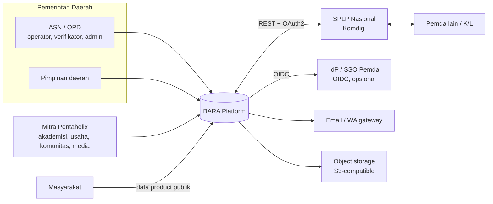
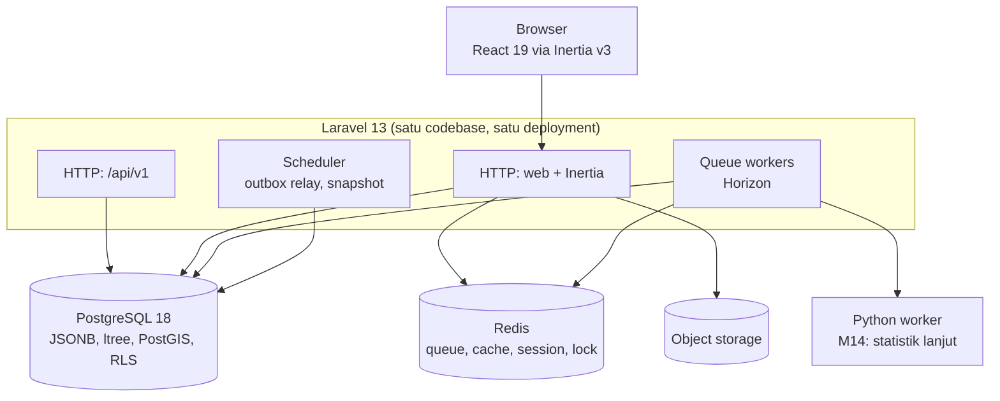
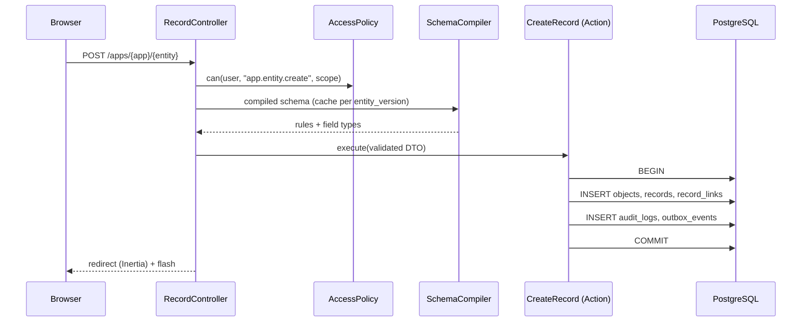

# 03 — Arsitektur

## 1. Konteks sistem (C4 level 1)



## 2. Container (C4 level 2)



Semua proses Laravel berasal dari **image/rilis yang sama**. Yang berbeda hanya perintah jalannya (`php-fpm`/Octane, `horizon`, `schedule:work`).

## 3. Modul (bounded context)

| Modul | Tanggung jawab | Milik tabel |
|---|---|---|
| `Identity` | User, autentikasi, API client, sesi | `users`, `api_clients`, `personal_access_tokens` |
| `Organization` | Hierarki organisasi, sektor, keanggotaan | `core_organizations`, `organization_memberships` |
| `Access` | Role, permission, assignment, clearance, evaluasi kebijakan | `roles`, `permissions`, `role_permissions`, `role_assignments` |
| `Metadata` | Application, entity, field, relationship, versi, form, view | `applications`, `entities`, `entity_versions`, `fields`, `relationships`, `forms`, `views`, `dashboards` |
| `Data` | Object registry, record, record link, Core entity lain, codelist | `objects`, `records`, `record_links`, `core_*`, `codelists`, `codelist_items`, `entity_consumers` |
| `Workflow` | Definisi, state, transisi, instance, history | `workflow_*` |
| `Processing` | Kompilasi & eksekusi DSL, run, lineage | `processes`, `process_versions`, `process_runs` |
| `Indicator` | Indikator, versi, nilai, target | `indicators`, `indicator_versions`, `indicator_values`, `indicator_targets` |
| `Presentation` | Resolusi view/dashboard ke query indikator/data product | (membaca `views`, `dashboards`) |
| `Eventing` | Outbox, relay, subscription, webhook, notifikasi | `outbox_events`, `processed_events`, `event_subscriptions`, `webhook_deliveries`, `notifications` |
| `Collaboration` | Pentahelix: Issue, Program, Activity, Contribution, ... (system entities) | (memakai `records` dan `record_links`) |
| `Integration` | Data product, API publik, konektor SPLP | `data_products`, `data_product_versions`, `data_product_grants` |
| `Audit` | Audit log append-only | `audit_logs` |
| `Files` | Upload, pemindaian, metadata file | `files` |

### Aturan dependensi (ditegakkan dengan arch test)

```text
Presentation ─┐
Integration ──┼──► Indicator ──► Processing ──► Data ──► Metadata
Collaboration ┘                                  │
Workflow ───────────────────────────────────────►┤
                                                 ▼
                                   Access ──► Organization ──► Identity
Audit, Eventing: boleh dipanggil semua modul, tetapi hanya lewat kontraknya
(AuditLogger, EventRecorder). Keduanya tidak boleh bergantung pada modul lain.
```

1. Modul hanya boleh memanggil modul lain lewat **kontrak publik** di `Contracts/`: interface, DTO, dan event. Tidak boleh memakai Eloquent model milik modul lain.
2. Query lintas modul untuk laporan harus lewat `Processing`/`Indicator`, bukan join ad-hoc.
3. Controller tidak berisi logika. Controller hanya memanggil **Action** (satu kelas satu use case).
4. Aturan ini diuji dengan `pest-plugin-arch` di CI.

## 4. Struktur folder

```text
app/
├── Modules/
│   ├── Metadata/
│   │   ├── Actions/            # PublishEntityVersion, AddField, ...
│   │   ├── Contracts/          # MetadataRepository, EntitySchema DTO
│   │   ├── Models/             # Eloquent, internal modul
│   │   ├── Http/Controllers/   # tipis
│   │   ├── Http/Requests/      # FormRequest
│   │   ├── Policies/
│   │   ├── Events/
│   │   └── Providers/MetadataServiceProvider.php
│   ├── Data/
│   │   ├── Runtime/            # RecordRepository, SchemaCompiler, RuleBuilder
│   │   └── ...
│   ├── Processing/
│   │   ├── Dsl/                # AST node (readonly class)
│   │   ├── Compiler/           # Dsl → Query Builder
│   │   ├── Formula/            # Lexer, Parser (Pratt), SqlEmitter
│   │   └── ...
│   └── ... (modul lain dengan pola sama)
├── Shared/                     # Value object lintas modul: Uuid, Period, Money, OrgPath
└── Support/                    # Helper teknis tanpa logika bisnis
database/
├── migrations/{modul}/         # dipisah per modul
└── seeders/                    # codelist, role bawaan, wilayah Kemendagri
resources/js/
├── pages/                      # Inertia pages
├── runtime/                    # FormRenderer, TableRenderer, ViewRenderer
├── components/ui/              # shadcn/ui (Radix), yang sudah dicek aksesibilitasnya
└── types/                      # TS type hasil generate dari DTO PHP
tests/
├── Arch/                       # aturan dependensi modul
├── Feature/{Modul}/
└── Unit/{Modul}/
```

## 5. Stack & versi (dicek September 2026)

| Komponen | Versi | Catatan |
|---|---|---|
| PHP | 8.5.x | `declare(strict_types=1)` di semua file. PHP 8.6 GA dijadwalkan Nov 2026; upgrade setelah Laravel mendukung. |
| Laravel | 13.x | |
| PostgreSQL | 18.x (≥ 18.6) | `uuidv7()` native, virtual generated column, extension `ltree`, `pg_trgm`, `postgis`. |
| Redis | 7.x / Valkey 8.x | Queue (Horizon), cache, lock, session. |
| Inertia | v3 | Wajib React 19+ dan Vite 7+. |
| React | 19.x | |
| TypeScript | 5.x, `strict: true` | |
| Tailwind CSS | 4.x | |
| UI primitives | shadcn/ui (Radix) | Primitive yang sudah menangani ARIA dan keyboard. |
| Testing | Pest 4, Vitest, Playwright + axe-core | |
| Static analysis | Larastan (PHPStan) level max, ESLint + typescript-eslint strict | |
| Formatter | Laravel Pint, Prettier | |
| API docs | OpenAPI 3.1 hasil generate (mis. `dedoc/scramble`) | |
| Object storage | S3-compatible (on-prem: SeaweedFS/Garage/Ceph RGW) | Status lisensi dan maintenance MinIO community perlu dicek dulu sebelum dipilih. |

## 6. Lingkungan pengembangan (Windows)

| Kebutuhan | Opsi utama | Alternatif |
|---|---|---|
| PHP 8.5 + Composer | Laragon (tambah versi PHP manual) | Laravel Herd for Windows |
| PostgreSQL 18 + PostGIS | Installer EDB + StackBuilder (PostGIS) | Docker Desktop (WSL2) image `postgis/postgis:18` |
| Redis | Docker (WSL2) | Memurai (Redis-compatible untuk Windows) |
| Node 22 LTS | nvm-windows | Volta |

`ltree`, `pg_trgm`, dan `pgcrypto` sudah ada di contrib PostgreSQL. Aktifkan dari migration pertama. **Tanda berhasil:** perintah `SELECT uuidv7(), 'a.b'::ltree;` berjalan tanpa error.

## 7. Alur request (runtime CRUD)



## 8. Prinsip teknis

1. **Server adalah sumber kebenaran validasi.** Validasi di client hanya untuk UX.
2. **Satu transaksi = satu use case.** Perubahan data, audit, dan outbox di-commit bersama.
3. **Tidak ada SQL mentah dari input pengguna.** Identifier selalu diambil dari metadata yang sudah divalidasi (whitelist).
4. **Cache berkunci versi.** `schema:{entity_version_id}` bersifat immutable, sehingga tidak perlu invalidasi.
5. **Idempotensi.** Semua listener dan endpoint `POST` mesin menerima `Idempotency-Key`.
6. **Observability sejak awal.** Setiap request dan job membawa `trace_id` ke log dan audit.
