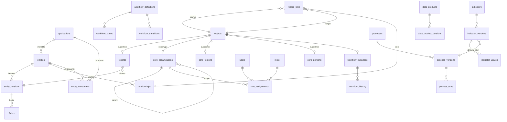

# 04 — Model Data

Konvensi:

- PK `id uuid DEFAULT uuidv7()`, kecuali disebut lain. UUIDv7 berurutan waktu, sehingga index B-tree tetap rapat ([ADR 0005](adr/0005-object-registry-uuidv7.md)).
- Semua timestamp `timestamptz`. Zona tampilan: `Asia/Jakarta` / `Asia/Makassar` / `Asia/Jayapura` sesuai Pemda.
- `code` = kode stabil yang dibaca manusia, `UNIQUE` dalam lingkupnya, pola `^[a-z][a-z0-9_]{1,62}$` untuk metadata.
- Soft delete (`deleted_at`) hanya untuk data bisnis. Metadata yang sudah dipublikasikan tidak dihapus, hanya di-_archive_.
- Semua FK memakai `ON DELETE RESTRICT`, kecuali disebut lain.

## Status implementasi

| Bagian                                                                                                                                                                       | Status                                                                                                                                                                                                                                                                              |
| ---------------------------------------------------------------------------------------------------------------------------------------------------------------------------- | ----------------------------------------------------------------------------------------------------------------------------------------------------------------------------------------------------------------------------------------------------------------------------------- |
| §2 objects, §3 applications & entities, §5 core_organizations (tanpa region_id), §6 users/roles/permissions/role_assignments, §9 outbox_events, processed_events, audit_logs | **Sudah (M0)**. `database/migrations/{platform,identity,access,audit,eventing}`                                                                                                                                                                                                     |
| §3 entity_versions, fields, relationships; kolom entities.published_version_id/draft_version_id/description                                                                  | **Sudah (M1)**. `database/migrations/metadata`                                                                                                                                                                                                                                      |
| audit_logs                                                                                                                                                                   | Trigger `audit_logs_append_only` menolak UPDATE/DELETE. Partisi bulan berjalan + 3 bulan dibuat migration, berikutnya oleh `bara:audit-partitions` (terjadwal).                                                                                                                     |
| entity_versions                                                                                                                                                              | Trigger `entity_versions_immutable` menolak perubahan isi versi terbit/superseded. Kolom tambahan `privacy_reviewed_by`, `privacy_reviewed_at` (persetujuan Pejabat PDP).                                                                                                           |
| relationships                                                                                                                                                                | Kolom tambahan `is_active` (relasi yang field-nya dihapus dinonaktifkan, tidak dihapus). Unik per `(source_entity_id, field_key)`.                                                                                                                                                  |
| §4 records, record_links, §10 files                                                                                                                                          | **Sudah (M2)**. `database/migrations/metadata/2026_09_26_000200_*`                                                                                                                                                                                                                  |
| records.data                                                                                                                                                                 | **Berkunci `field_key`, bukan kode** (ADR 0014). Filter kesetaraan lewat `data @> ?::jsonb` + index GIN `records_data_gin (jsonb_path_ops)`; field `is_indexed` juga mendapat index ekspresi `rf_*` dengan fungsi cast IMMUTABLE `bara_to_bigint/numeric/date/timestamptz/boolean`. |
| files.sha256                                                                                                                                                                 | Disimpan sebagai **hex text** (64 karakter), bukan bytea: biner lewat PDO gagal encoding. Kolom tambahan `extension`.                                                                                                                                                               |
| entity_consumers, metadata_dependencies, forms, views, dashboards                                                                                                            | Belum (M4, M7, M2+, M9)                                                                                                                                                                                                                                                             |
| Sisanya                                                                                                                                                                      | Sesuai milestone di doc 12                                                                                                                                                                                                                                                          |

## 1. Gambaran besar



## 2. Object registry (fondasi integritas lintas storage)

```sql
CREATE TABLE objects (
    id           uuid PRIMARY KEY DEFAULT uuidv7(),
    entity_id    uuid NOT NULL REFERENCES entities(id),
    owner_org_id uuid NOT NULL,            -- FK ke core_organizations, ditambah setelah tabel dibuat
    owner_path   ltree NOT NULL,           -- denormalisasi path organisasi untuk filter scope cepat
    visibility   text NOT NULL DEFAULT 'private'
                 CHECK (visibility IN ('private','internal','partner','public')),
    created_at   timestamptz NOT NULL DEFAULT now(),
    deleted_at   timestamptz
);
CREATE INDEX objects_owner_path_gist ON objects USING gist (owner_path);
CREATE INDEX objects_entity_idx ON objects (entity_id) WHERE deleted_at IS NULL;
```

**Kenapa perlu tabel ini:** relasi bisa menunjuk ke record JSONB _atau_ ke baris Core fisik. Karena setiap objek punya baris di `objects`, `record_links.target_id` cukup satu FK ke `objects.id`, dan integritas referensial dijaga database, bukan kode. Tabel ini juga menjadi titik tunggal untuk scope akses, audit, workflow, dan event.

Pola: **class-table inheritance**. `records.id` dan `core_*.id` adalah PK sekaligus FK ke `objects.id`.

> **Bootstrap melingkar.** Rantai ketergantungannya: `applications.owner_org_id` → `core_organizations` → `objects` → `entities` → `applications`. Karena itu, FK `objects.owner_org_id`, `objects.entity_id`, dan `applications.owner_org_id` dibuat `DEFERRABLE INITIALLY DEFERRED`. Seeder `PlatformBootstrap` membuat organisasi root Pemda, aplikasi `core`, entity Core, dan baris `objects`-nya dalam **satu transaksi**.

> Perubahan `owner_path` (reorganisasi OPD) memicu job `RebuildOwnerPaths` yang meng-update `objects` secara batch per 5.000 baris.

## 3. Metadata

```sql
CREATE TABLE applications (
    id           uuid PRIMARY KEY DEFAULT uuidv7(),
    code         text NOT NULL UNIQUE,
    name         text NOT NULL,
    description  text,
    owner_org_id uuid NOT NULL REFERENCES core_organizations(id),
    status       text NOT NULL DEFAULT 'draft' CHECK (status IN ('draft','active','archived')),
    is_system    boolean NOT NULL DEFAULT false,     -- 'core', 'collaboration'
    created_at   timestamptz NOT NULL DEFAULT now(),
    updated_at   timestamptz NOT NULL DEFAULT now()
);

CREATE TABLE entities (
    id                   uuid PRIMARY KEY DEFAULT uuidv7(),
    application_id       uuid NOT NULL REFERENCES applications(id),
    code                 text NOT NULL,                 -- 'realization'
    name                 text NOT NULL,
    name_plural          text NOT NULL,
    storage_type         text NOT NULL CHECK (storage_type IN ('physical','document')),
    physical_table       text,                          -- wajib jika physical, whitelist
    is_system            boolean NOT NULL DEFAULT false,
    is_shared            boolean NOT NULL DEFAULT false, -- boleh dikonsumsi app lain
    default_visibility   text NOT NULL DEFAULT 'private',
    title_template       text NOT NULL DEFAULT '{name}', -- label record di selector
    published_version_id uuid,                           -- FK ke entity_versions
    draft_version_id     uuid,
    created_at timestamptz NOT NULL DEFAULT now(),
    updated_at timestamptz NOT NULL DEFAULT now(),
    UNIQUE (application_id, code),
    CHECK (storage_type = 'document' OR physical_table IS NOT NULL)
);

CREATE TABLE entity_versions (
    id              uuid PRIMARY KEY DEFAULT uuidv7(),
    entity_id       uuid NOT NULL REFERENCES entities(id),
    version         integer NOT NULL,
    status          text NOT NULL CHECK (status IN ('draft','published','superseded')),
    compiled_schema jsonb,                    -- hasil kompilasi (JSON Schema + rules), diisi saat publish
    change_summary  text,
    published_at    timestamptz,
    published_by    uuid REFERENCES users(id),
    UNIQUE (entity_id, version)
);
-- hanya satu draft per entity
CREATE UNIQUE INDEX entity_versions_one_draft ON entity_versions (entity_id) WHERE status = 'draft';

CREATE TABLE fields (
    id                uuid PRIMARY KEY DEFAULT uuidv7(),
    entity_version_id uuid NOT NULL REFERENCES entity_versions(id),
    field_key         uuid NOT NULL,   -- identitas stabil lintas versi (rename tidak memutus data)
    code              text NOT NULL,   -- key di JSONB
    label             text NOT NULL,
    help_text         text,
    type              text NOT NULL,   -- lihat doc 06 §1
    is_required       boolean NOT NULL DEFAULT false,
    is_unique         boolean NOT NULL DEFAULT false,
    is_indexed        boolean NOT NULL DEFAULT false,
    is_searchable     boolean NOT NULL DEFAULT false,
    classification    text NOT NULL DEFAULT 'internal'
                      CHECK (classification IN ('public','internal','restricted','personal','personal_specific')),
    config            jsonb NOT NULL DEFAULT '{}',   -- min, max, options, codelist, pattern, ...
    position          integer NOT NULL,
    UNIQUE (entity_version_id, code),
    UNIQUE (entity_version_id, field_key)
);

CREATE TABLE relationships (
    id               uuid PRIMARY KEY DEFAULT uuidv7(),
    field_key        uuid NOT NULL,          -- field bertipe relationship di source
    source_entity_id uuid NOT NULL REFERENCES entities(id),
    target_entity_id uuid NOT NULL REFERENCES entities(id),
    code             text NOT NULL,          -- 'opd', 'activity'
    cardinality      text NOT NULL CHECK (cardinality IN ('many_to_one','many_to_many')),
    inverse_code     text,                   -- 'realizations' (navigasi balik)
    on_target_delete text NOT NULL DEFAULT 'restrict' CHECK (on_target_delete IN ('restrict','nullify')),
    UNIQUE (source_entity_id, code)
);

CREATE TABLE entity_consumers (              -- pendaftaran konsumen shared entity
    entity_id      uuid NOT NULL REFERENCES entities(id),
    application_id uuid NOT NULL REFERENCES applications(id),
    access         text NOT NULL CHECK (access IN ('reference','read','aggregate')),
    approved_by    uuid REFERENCES users(id),
    approved_at    timestamptz,
    PRIMARY KEY (entity_id, application_id)
);

CREATE TABLE metadata_dependencies (         -- diisi saat process/view/indicator/workflow dipublikasikan
    dependent_type text NOT NULL CHECK (dependent_type IN ('process_version','view','indicator_version','workflow_definition','form','data_product_version')),
    dependent_id   uuid NOT NULL,
    entity_id      uuid NOT NULL REFERENCES entities(id),
    field_key      uuid,                     -- NULL = bergantung pada entity secara keseluruhan
    PRIMARY KEY (dependent_type, dependent_id, entity_id, field_key)
);
CREATE INDEX metadata_dependencies_field ON metadata_dependencies (entity_id, field_key);

CREATE TABLE forms (
    id                uuid PRIMARY KEY DEFAULT uuidv7(),
    entity_id         uuid NOT NULL REFERENCES entities(id),
    code              text NOT NULL,
    layout            jsonb NOT NULL,     -- sections → field_key[], kondisi tampil
    is_default        boolean NOT NULL DEFAULT false,
    UNIQUE (entity_id, code)
);

CREATE TABLE views (
    id             uuid PRIMARY KEY DEFAULT uuidv7(),
    application_id uuid NOT NULL REFERENCES applications(id),
    code           text NOT NULL,
    type           text NOT NULL CHECK (type IN ('table','detail','kpi','bar','line','pie','stacked')),
    source_type    text NOT NULL CHECK (source_type IN ('entity','indicator','data_product')),
    source_id      uuid NOT NULL,
    config         jsonb NOT NULL,        -- kolom, dimensi, filter parameter, format
    UNIQUE (application_id, code)
);

CREATE TABLE dashboards (
    id             uuid PRIMARY KEY DEFAULT uuidv7(),
    application_id uuid NOT NULL REFERENCES applications(id),
    code           text NOT NULL,
    title          text NOT NULL,
    layout         jsonb NOT NULL,        -- [{view_id, x, y, w, h}], parameter global (tahun, OPD)
    visibility     text NOT NULL DEFAULT 'internal',
    UNIQUE (application_id, code)
);
```

## 4. Data runtime

```sql
CREATE TABLE records (
    id                uuid PRIMARY KEY REFERENCES objects(id),
    entity_id         uuid NOT NULL REFERENCES entities(id),
    entity_version_id uuid NOT NULL REFERENCES entity_versions(id),
    data              jsonb NOT NULL,                  -- {field_code: value}, TANPA relasi
    title             text NOT NULL,                   -- hasil title_template, untuk search & selector
    search            tsvector GENERATED ALWAYS AS (to_tsvector('simple', title)) STORED,
    lock_version      integer NOT NULL DEFAULT 0,      -- optimistic locking
    revision_of       uuid REFERENCES records(id),     -- koreksi record yang sudah final (doc 08 §1.1)
    created_by        uuid NOT NULL REFERENCES users(id),
    updated_by        uuid NOT NULL REFERENCES users(id),
    created_at        timestamptz NOT NULL DEFAULT now(),
    updated_at        timestamptz NOT NULL DEFAULT now(),
    deleted_at        timestamptz
);
CREATE INDEX records_entity_created ON records (entity_id, created_at DESC) WHERE deleted_at IS NULL;
CREATE INDEX records_search ON records USING gin (search);
CREATE INDEX records_title_trgm ON records USING gin (title gin_trgm_ops);

CREATE TABLE record_links (
    id              uuid PRIMARY KEY DEFAULT uuidv7(),
    relationship_id uuid NOT NULL REFERENCES relationships(id),
    source_id       uuid NOT NULL REFERENCES objects(id) ON DELETE CASCADE,
    target_id       uuid NOT NULL REFERENCES objects(id),
    position        integer NOT NULL DEFAULT 0,
    created_at      timestamptz NOT NULL DEFAULT now(),
    UNIQUE (relationship_id, source_id, target_id)
);
CREATE INDEX record_links_target ON record_links (target_id, relationship_id);
-- many_to_one: satu link per source per relationship
-- ditegakkan oleh Action + partial unique index yang dibuat per relationship many_to_one:
-- CREATE UNIQUE INDEX ... ON record_links (source_id) WHERE relationship_id = '<id>';
```

### Index per field (dinamis, dikontrol)

Kalau `fields.is_indexed = true` dipublikasikan, job `EnsureFieldIndex` menjalankan:

```sql
CREATE INDEX CONCURRENTLY IF NOT EXISTS rf_<hash8>
    ON records (((data->>'year')::int))          -- cast sesuai tipe field
    WHERE entity_id = '<entity_uuid>' AND deleted_at IS NULL;
```

- Nama index di-_hash_ dari `(entity_id, field_key)`. Tidak ada identifier dari input pengguna.
- Cast memakai fungsi `IMMUTABLE` bawaan (`::int`, `::numeric`, `::date`). Untuk `date` dipakai helper `bara_to_date(text)` yang dideklarasikan `IMMUTABLE`, karena `::date` pada text bergantung setting `DateStyle`.
- Maksimal 8 index per entity (dikonfigurasi). Kalau lebih dari itu, pertimbangkan promosi ke tabel fisik.
- `is_unique` memakai `CREATE UNIQUE INDEX` serupa.

### Promosi ke tabel fisik

Entity `document` dipromosikan jika memenuhi salah satu syarat: > 2 juta record, > 8 field ter-index, atau dibutuhkan FK/constraint kompleks. Prosedurnya: buat tabel `x_<app>_<entity>`, backfill, lalu ubah `storage_type` pada versi baru. Kontrak `RecordRepository` tidak berubah. Prosedur ini sengaja manual (lewat migration yang di-review), bukan dari UI.

## 5. Core entities (fisik)

```sql
CREATE TABLE core_organizations (
    id          uuid PRIMARY KEY REFERENCES objects(id),
    parent_id   uuid REFERENCES core_organizations(id),
    code        text NOT NULL UNIQUE,         -- kode internal/SIPD bila ada
    name        text NOT NULL,
    short_name  text,
    sector      text NOT NULL CHECK (sector IN ('government','academia','business','community','media')),
    kind        text NOT NULL,                -- 'pemda','opd','bidang','seksi','uptd','kampus','perusahaan',...
    path        ltree NOT NULL UNIQUE,        -- 'pemda.dinkes.bid_p2p'
    is_internal boolean NOT NULL,             -- true = bagian dari Pemda
    region_id   uuid REFERENCES core_regions(id),
    verified_at timestamptz,                  -- verifikasi mitra eksternal
    valid_from  date NOT NULL DEFAULT CURRENT_DATE,
    valid_to    date                          -- nomenklatur OPD berubah → histori, bukan hapus
);
CREATE INDEX core_org_path_gist ON core_organizations USING gist (path);

CREATE TABLE organization_memberships (      -- user eksternal ↔ organisasi mitra (Pentahelix)
    user_id     uuid NOT NULL REFERENCES users(id),
    org_id      uuid NOT NULL REFERENCES core_organizations(id),
    position    text,
    status      text NOT NULL CHECK (status IN ('pending','verified','revoked')),
    verified_by uuid REFERENCES users(id),
    verified_at timestamptz,
    PRIMARY KEY (user_id, org_id)
);

CREATE TABLE core_regions (                   -- Kepmendagri kode wilayah
    id         uuid PRIMARY KEY REFERENCES objects(id),
    code       text NOT NULL UNIQUE,          -- '64.72.01.1001' format Kemendagri
    name       text NOT NULL,
    level      smallint NOT NULL CHECK (level BETWEEN 1 AND 4), -- prov, kab/kota, kec, desa/kel
    parent_id  uuid REFERENCES core_regions(id),
    geom       geometry(MultiPolygon, 4326),  -- PostGIS, M14
    source_ref text NOT NULL                  -- nomor Kepmendagri sumber
);

CREATE TABLE core_persons (
    id           uuid PRIMARY KEY REFERENCES objects(id),
    full_name    text NOT NULL,
    nik_hash     bytea UNIQUE,                -- HMAC-SHA256(NIK, pepper). Untuk dedup, bukan tampilan
    nik_enc      bytea,                       -- NIK terenkripsi (app-level), hanya untuk role berizin
    email        citext,
    phone        text,
    created_at   timestamptz NOT NULL DEFAULT now()
);

CREATE TABLE core_employees (
    id         uuid PRIMARY KEY REFERENCES objects(id),
    person_id  uuid NOT NULL REFERENCES core_persons(id),
    nip        text UNIQUE,                   -- ASN; NULL untuk non-ASN
    org_id     uuid NOT NULL REFERENCES core_organizations(id),
    position   text,
    rank       text,
    valid_from date NOT NULL,
    valid_to   date
);

CREATE TABLE core_fiscal_years (
    id        uuid PRIMARY KEY REFERENCES objects(id),
    year      smallint NOT NULL UNIQUE,
    starts_on date NOT NULL,
    ends_on   date NOT NULL,
    status    text NOT NULL CHECK (status IN ('planning','running','closed'))
);

CREATE TABLE codelists (
    id           uuid PRIMARY KEY DEFAULT uuidv7(),
    code         text NOT NULL UNIQUE,         -- 'status_publikasi', 'urusan_pemerintahan'
    name         text NOT NULL,
    owner_org_id uuid NOT NULL REFERENCES core_organizations(id),
    source_ref   text                          -- regulasi/standar asal
);
CREATE TABLE codelist_items (
    id          uuid PRIMARY KEY DEFAULT uuidv7(),
    codelist_id uuid NOT NULL REFERENCES codelists(id),
    code        text NOT NULL,
    label       text NOT NULL,
    parent_code text,
    sort_order  integer NOT NULL DEFAULT 0,
    is_active   boolean NOT NULL DEFAULT true,
    UNIQUE (codelist_id, code)
);
```

**Catatan UU PDP:** NIK tidak pernah disimpan plaintext. Dedup memakai HMAC dengan _pepper_ yang disimpan di secret manager/env, bukan di DB. Tampilan NIK memerlukan clearance `personal` dan dicatat di audit (`pii.revealed`).

## 6. Identity & Access

```sql
CREATE TABLE users (
    id              uuid PRIMARY KEY DEFAULT uuidv7(),
    person_id       uuid REFERENCES core_persons(id),   -- ditambahkan di M4 bersama core_persons
    name            text NOT NULL,
    email           citext NOT NULL UNIQUE,
    email_verified_at timestamptz,
    password        text,                       -- NULL jika hanya SSO
    kind            text NOT NULL CHECK (kind IN ('internal','external','service')),
    primary_org_id  uuid NOT NULL REFERENCES core_organizations(id),
    is_active       boolean NOT NULL DEFAULT true,
    last_login_at   timestamptz,
    two_factor_secret text,                     -- terenkripsi (Fortify)
    two_factor_recovery_codes text,             -- terenkripsi (Fortify)
    two_factor_confirmed_at timestamptz,
    remember_token  varchar(100),
    created_at timestamptz,
    updated_at timestamptz
);

CREATE TABLE roles (
    id             uuid PRIMARY KEY DEFAULT uuidv7(),
    code           text NOT NULL,
    application_id uuid REFERENCES applications(id),   -- NULL = role platform
    name           text NOT NULL,
    clearance      text NOT NULL DEFAULT 'internal',     -- klasifikasi tertinggi yang boleh dibaca
    is_system      boolean NOT NULL DEFAULT false,
    UNIQUE NULLS NOT DISTINCT (application_id, code)
);

CREATE TABLE permissions (
    code        text PRIMARY KEY,           -- 'monev.realization.create', 'platform.metadata.publish'
    description text NOT NULL
);

CREATE TABLE role_permissions (
    role_id         uuid NOT NULL REFERENCES roles(id),
    permission_code text NOT NULL REFERENCES permissions(code),
    PRIMARY KEY (role_id, permission_code)
);

CREATE TABLE role_assignments (
    id                  uuid PRIMARY KEY DEFAULT uuidv7(),
    user_id             uuid NOT NULL REFERENCES users(id),
    role_id             uuid NOT NULL REFERENCES roles(id),
    scope_org_id        uuid NOT NULL REFERENCES core_organizations(id),
    include_descendants boolean NOT NULL DEFAULT true,
    valid_from          timestamptz NOT NULL DEFAULT now(),
    valid_to            timestamptz,            -- penugasan sementara (Plt)
    granted_by          uuid NOT NULL REFERENCES users(id),
    UNIQUE (user_id, role_id, scope_org_id)
);

CREATE TABLE api_clients (
    id            uuid PRIMARY KEY DEFAULT uuidv7(),
    name          text NOT NULL,
    owner_org_id  uuid NOT NULL REFERENCES core_organizations(id),
    client_type   text NOT NULL CHECK (client_type IN ('internal_app','splp','partner')),
    scopes        text[] NOT NULL,
    rate_limit_per_minute integer NOT NULL DEFAULT 60,
    is_active     boolean NOT NULL DEFAULT true
);
```

Permission untuk entity di-_generate_ saat entity dipublikasikan: `{app}.{entity}.{view|create|update|delete|export}` ditambah satu permission per action workflow.

## 7. Workflow

```sql
CREATE TABLE workflow_definitions (
    id          uuid PRIMARY KEY DEFAULT uuidv7(),
    entity_id   uuid NOT NULL REFERENCES entities(id),
    version     integer NOT NULL,
    status      text NOT NULL CHECK (status IN ('draft','published','superseded')),
    initial_state_code text NOT NULL,
    UNIQUE (entity_id, version)
);
CREATE TABLE workflow_states (
    id            uuid PRIMARY KEY DEFAULT uuidv7(),
    definition_id uuid NOT NULL REFERENCES workflow_definitions(id),
    code          text NOT NULL,
    label         text NOT NULL,
    is_final      boolean NOT NULL DEFAULT false,
    locks_record  boolean NOT NULL DEFAULT false,  -- data tidak bisa diedit di state ini
    UNIQUE (definition_id, code)
);
CREATE TABLE workflow_transitions (
    id               uuid PRIMARY KEY DEFAULT uuidv7(),
    definition_id    uuid NOT NULL REFERENCES workflow_definitions(id),
    action_code      text NOT NULL,             -- 'submit','verify','reject','return','approve','publish'
    from_state_code  text NOT NULL,
    to_state_code    text NOT NULL,
    permission_code  text NOT NULL REFERENCES permissions(code),
    guard            jsonb,                     -- ekspresi formula boolean (doc 07 §3), opsional
    requires_comment boolean NOT NULL DEFAULT false,
    separation_of_duty boolean NOT NULL DEFAULT false, -- pelaku ≠ pelaku transisi sebelumnya
    UNIQUE (definition_id, action_code, from_state_code)
);
CREATE TABLE workflow_instances (
    object_id      uuid PRIMARY KEY REFERENCES objects(id),
    definition_id  uuid NOT NULL REFERENCES workflow_definitions(id),
    current_state  text NOT NULL,
    lock_version   integer NOT NULL DEFAULT 0,
    updated_at     timestamptz NOT NULL DEFAULT now()
);
CREATE INDEX workflow_instances_state ON workflow_instances (definition_id, current_state);
CREATE TABLE workflow_history (
    id          uuid PRIMARY KEY DEFAULT uuidv7(),
    object_id   uuid NOT NULL REFERENCES objects(id),
    action_code text NOT NULL,
    from_state  text NOT NULL,
    to_state    text NOT NULL,
    actor_id    uuid NOT NULL REFERENCES users(id),
    comment     text,
    occurred_at timestamptz NOT NULL DEFAULT now()
);
```

## 8. Processing & Indicator

```sql
CREATE TABLE processes (
    id             uuid PRIMARY KEY DEFAULT uuidv7(),
    code           text NOT NULL UNIQUE,
    name           text NOT NULL,
    owner_org_id   uuid NOT NULL REFERENCES core_organizations(id),
    application_id uuid REFERENCES applications(id)
);
CREATE TABLE process_versions (
    id          uuid PRIMARY KEY DEFAULT uuidv7(),
    process_id  uuid NOT NULL REFERENCES processes(id),
    version     integer NOT NULL,
    status      text NOT NULL CHECK (status IN ('draft','published','superseded')),
    definition  jsonb NOT NULL,          -- DSL (doc 07)
    parameters  jsonb NOT NULL DEFAULT '[]',  -- [{name:'year', type:'integer', required:true}]
    output_schema jsonb,                 -- hasil kompilasi: kolom + tipe
    source_entity_ids uuid[] NOT NULL,   -- untuk dependency & invalidasi
    UNIQUE (process_id, version)
);
CREATE TABLE process_runs (
    id                 uuid PRIMARY KEY DEFAULT uuidv7(),
    process_version_id uuid NOT NULL REFERENCES process_versions(id),
    params             jsonb NOT NULL,
    params_hash        bytea NOT NULL,
    trigger            text NOT NULL CHECK (trigger IN ('manual','schedule','event','api')),
    status             text NOT NULL CHECK (status IN ('queued','running','succeeded','failed','timeout')),
    rows_in            bigint,
    rows_out           bigint,
    source_watermark   timestamptz,       -- max(updated_at) data sumber saat run
    error              text,
    started_at timestamptz, finished_at timestamptz
);

CREATE TABLE indicators (
    id           uuid PRIMARY KEY DEFAULT uuidv7(),
    code         text NOT NULL UNIQUE,     -- 'persentase_dataset_dipublikasikan'
    name         text NOT NULL,
    owner_org_id uuid NOT NULL REFERENCES core_organizations(id),
    visibility   text NOT NULL DEFAULT 'internal'
);
CREATE TABLE indicator_versions (
    id                 uuid PRIMARY KEY DEFAULT uuidv7(),
    indicator_id       uuid NOT NULL REFERENCES indicators(id),
    version            integer NOT NULL,
    status             text NOT NULL CHECK (status IN ('draft','published','superseded')),
    process_version_id uuid NOT NULL REFERENCES process_versions(id),
    value_column       text NOT NULL,       -- kolom output process yang menjadi nilai
    dimension_columns  text[] NOT NULL,     -- kolom output yang menjadi dimensi
    period_grain       text NOT NULL CHECK (period_grain IN ('year','semester','quarter','month')),
    unit               text NOT NULL,       -- '%', 'orang', 'Rp'
    decimals           smallint NOT NULL DEFAULT 2,
    direction          text NOT NULL CHECK (direction IN ('higher_better','lower_better','target_band')),
    definition_text    text NOT NULL,       -- definisi operasional untuk manusia
    UNIQUE (indicator_id, version)
);
CREATE TABLE indicator_values (
    indicator_version_id uuid NOT NULL REFERENCES indicator_versions(id),
    period               text NOT NULL,       -- '2026', '2026-S1', '2026-Q3', '2026-09'
    dimension_key        text NOT NULL,       -- hash stabil dari dimensions
    dimensions           jsonb NOT NULL,      -- {"opd": "<uuid>", "region": "<uuid>"}
    value                numeric,
    numerator            numeric,
    denominator          numeric,
    process_run_id       uuid NOT NULL REFERENCES process_runs(id),
    computed_at          timestamptz NOT NULL,
    is_final             boolean NOT NULL DEFAULT false,  -- dikunci setelah periode ditutup
    PRIMARY KEY (indicator_version_id, period, dimension_key)
);
CREATE INDEX indicator_values_dims ON indicator_values USING gin (dimensions jsonb_path_ops);
CREATE TABLE indicator_targets (
    indicator_id  uuid NOT NULL REFERENCES indicators(id),
    period        text NOT NULL,
    dimension_key text NOT NULL,
    dimensions    jsonb NOT NULL,
    target_value  numeric NOT NULL,
    source_ref    text,                 -- RPJMD/Renstra/Renja
    PRIMARY KEY (indicator_id, period, dimension_key)
);
```

## 9. Eventing & Audit

```sql
CREATE TABLE outbox_events (
    id             uuid PRIMARY KEY DEFAULT uuidv7(),
    event_type     text NOT NULL,           -- 'record.approved'
    aggregate_type text NOT NULL,           -- entity code atau 'indicator'
    aggregate_id   uuid NOT NULL,
    payload        jsonb NOT NULL,          -- TANPA data pribadi; hanya id + field yang berubah
    trace_id       text,
    occurred_at    timestamptz NOT NULL DEFAULT now(),
    published_at   timestamptz,
    attempts       integer NOT NULL DEFAULT 0,
    last_error     text
);
CREATE INDEX outbox_unpublished ON outbox_events (occurred_at) WHERE published_at IS NULL;

CREATE TABLE processed_events (
    listener   text NOT NULL,
    event_id   uuid NOT NULL,
    processed_at timestamptz NOT NULL DEFAULT now(),
    PRIMARY KEY (listener, event_id)
);

CREATE TABLE event_subscriptions (
    id          uuid PRIMARY KEY DEFAULT uuidv7(),
    event_type  text NOT NULL,
    filter      jsonb,                     -- mis. {"entity": "dataset"}
    handler     text NOT NULL CHECK (handler IN ('recalculate_indicator','notify','webhook','start_process')),
    config      jsonb NOT NULL,
    is_active   boolean NOT NULL DEFAULT true,
    owner_app_id uuid REFERENCES applications(id)
);

CREATE TABLE audit_logs (
    id          uuid NOT NULL DEFAULT uuidv7(),
    occurred_at timestamptz NOT NULL DEFAULT now(),
    actor_type  text NOT NULL CHECK (actor_type IN ('user','api_client','system')),
    actor_id    uuid,
    action      text NOT NULL,             -- 'record.update', 'role.assign', 'pii.revealed'
    object_id   uuid,
    object_type text,
    changes     jsonb,                     -- {field: [old, new]}; field personal di-mask
    context     jsonb,                     -- data tambahan non-PII (mis. jenis perubahan 2FA)
    ip          inet,
    user_agent  text,
    trace_id    text,
    prev_hash   bytea,                     -- hash chain opsional (ADR 0011), belum diimplementasikan
    PRIMARY KEY (id, occurred_at)
) PARTITION BY RANGE (occurred_at);
```

## 10. Integration

```sql
CREATE TABLE data_products (
    id           uuid PRIMARY KEY DEFAULT uuidv7(),
    code         text NOT NULL UNIQUE,      -- 'population_by_kelurahan'
    name         text NOT NULL,
    description  text NOT NULL,
    owner_org_id uuid NOT NULL REFERENCES core_organizations(id),
    access_policy text NOT NULL CHECK (access_policy IN ('public','internal','restricted')),
    update_frequency text NOT NULL,         -- 'daily','monthly','on_event'
    quality_status text NOT NULL DEFAULT 'draft'
                   CHECK (quality_status IN ('draft','provisional','verified','deprecated'))
);
CREATE TABLE data_product_versions (
    id              uuid PRIMARY KEY DEFAULT uuidv7(),
    data_product_id uuid NOT NULL REFERENCES data_products(id),
    version         text NOT NULL,          -- semver '1.2.0'
    source_type     text NOT NULL CHECK (source_type IN ('indicator','process','entity')),
    source_id       uuid NOT NULL,
    schema          jsonb NOT NULL,         -- JSON Schema output (kontrak)
    status          text NOT NULL CHECK (status IN ('draft','published','deprecated')),
    sunset_at       date,                   -- deprecation dengan tanggal
    UNIQUE (data_product_id, version)
);
CREATE TABLE data_product_grants (
    data_product_id uuid NOT NULL REFERENCES data_products(id),
    grantee_type    text NOT NULL CHECK (grantee_type IN ('application','api_client','role')),
    grantee_id      uuid NOT NULL,
    granted_by      uuid NOT NULL REFERENCES users(id),
    granted_at      timestamptz NOT NULL DEFAULT now(),
    PRIMARY KEY (data_product_id, grantee_type, grantee_id)
);

CREATE TABLE files (
    id           uuid PRIMARY KEY DEFAULT uuidv7(),
    object_id    uuid REFERENCES objects(id),
    field_key    uuid,
    disk         text NOT NULL,
    path         text NOT NULL,             -- nama acak, bukan nama asli
    original_name text NOT NULL,
    mime_type    text NOT NULL,             -- hasil deteksi server (finfo), bukan dari klien
    size_bytes   bigint NOT NULL,
    sha256       bytea NOT NULL,
    scan_status  text NOT NULL DEFAULT 'pending' CHECK (scan_status IN ('pending','clean','infected','error')),
    classification text NOT NULL DEFAULT 'internal',
    uploaded_by  uuid NOT NULL REFERENCES users(id),
    created_at   timestamptz NOT NULL DEFAULT now()
);
```

## 11. Strategi index & performa (ringkas)

| Pola query                        | Index                                                |
| --------------------------------- | ---------------------------------------------------- |
| Daftar record per entity, terbaru | `records (entity_id, created_at DESC)` partial       |
| Filter scope organisasi           | `objects.owner_path` GiST + `<@` operator            |
| Filter/sort field                 | index ekspresi partial per field (`is_indexed`)      |
| Pencarian judul                   | GIN `tsvector` + `pg_trgm`                           |
| Navigasi relasi balik             | `record_links (target_id, relationship_id)`          |
| Dashboard                         | Hanya membaca `indicator_values` (PK sudah mencakup) |
| Outbox relay                      | Partial index `WHERE published_at IS NULL`           |

**N+1:** `RecordRepository::list()` wajib melakukan _eager load_ relasi yang tampil di kolom tabel dalam **satu** query `record_links JOIN records` per relationship (batch `WHERE source_id = ANY($1)`), bukan per baris.
