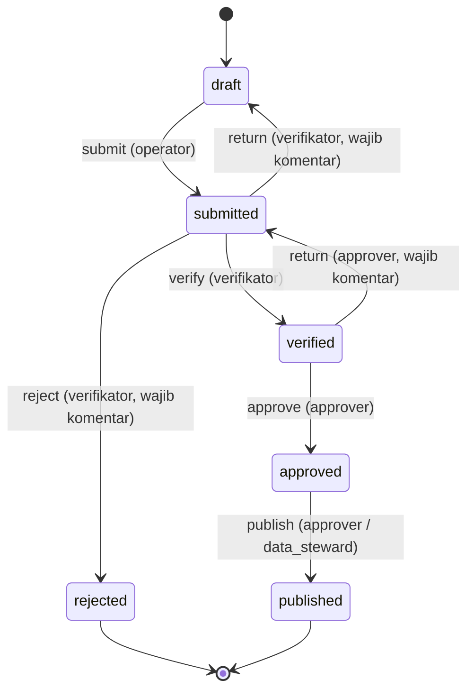

# 08 — Workflow Engine & Event Engine

## 1. Workflow

### 1.1 Definisi default (template "Verifikasi Berjenjang")



| State     | `locks_record` | Catatan                                                                       |
| --------- | -------------- | ----------------------------------------------------------------------------- |
| draft     | tidak          | Operator bebas edit                                                           |
| submitted | ya             | Hanya bisa kembali lewat `return`                                             |
| verified  | ya             |                                                                               |
| approved  | ya             |                                                                               |
| published | ya             | Final. Koreksi lewat record revisi baru (`revision_of`), bukan edit langsung. |
| rejected  | ya             | Final                                                                         |

Template bisa disalin dan dimodifikasi per entity, misalnya satu tingkat (`draft → submitted → approved`) untuk data sederhana.

### 1.2 Eksekusi transisi

```text
TransitionRecord(object_id, action_code, comment, expected_lock_version)
 1. BEGIN
 2. SELECT ... FROM workflow_instances WHERE object_id = ? FOR UPDATE
 3. cek lock_version = expected (konflik → 409, UI minta refresh)
 4. cari transisi (definition, action_code, from = current_state), tidak ada → 422
 5. authorize permission_code pada scope objek
 6. separation_of_duty? pelaku ≠ actor transisi terakhir → kalau sama, 403
 7. requires_comment? comment wajib
 8. guard (formula boolean atas data record) harus true, mis. "physical_pct >= 0 and budget_realized <= budget_ceiling"
 9. UPDATE workflow_instances (current_state, lock_version + 1)
10. INSERT workflow_history, audit_logs
11. outbox: record.{action}ed (submitted/verified/approved/...) + workflow.transitioned
12. COMMIT
```

Semua aksi lewat satu Action (`TransitionRecord`), baik dari UI, API, maupun bulk. Bulk transition menjalankan loop per record dengan hasil per item (sebagian bisa gagal).

### 1.3 Aturan tambahan

- **Versi workflow.** Instance tetap mengikuti `definition_id` saat dibuat. Migrasi ke versi baru dilakukan eksplisit lewat pemetaan state lama → baru.
- **Tenggat & eskalasi** (M10): `workflow_states.config.sla_hours`; scheduler menandai overdue dan mengirim `workflow.overdue`.
- **Inbox.** Halaman "Tugas saya" = instance pada state yang punya transisi di mana user memiliki permission + scope. Query ini di-index `workflow_instances (definition_id, current_state)`.

## 2. Event engine

### 2.1 Kenapa transactional outbox

```text
Tanpa outbox:  UPDATE record → COMMIT → dispatch ke Redis ✗ (Redis down) → event hilang
               atau dispatch → ROLLBACK → event "hantu" untuk data yang tidak pernah ada
Dengan outbox: UPDATE record + INSERT outbox_events dalam SATU transaksi
               → relay membaca outbox → dispatch → tandai published
```

Jaminannya adalah **at-least-once delivery**, sehingga listener wajib idempotent.

### 2.2 Relay

```sql
-- dijalankan tiap 1 detik oleh `bara:outbox-relay` (long-running, via Supervisor)
WITH batch AS (
  SELECT id FROM outbox_events
  WHERE published_at IS NULL AND attempts < 10
  ORDER BY occurred_at
  LIMIT 100
  FOR UPDATE SKIP LOCKED
)
SELECT e.* FROM outbox_events e JOIN batch USING (id);
-- untuk setiap event: dispatch job per subscription yang cocok → UPDATE published_at = now()
```

- `SKIP LOCKED` membuat beberapa relay aman berjalan paralel.
- Event yang gagal lebih dari 10 kali masuk status _dead letter_ dan muncul di halaman admin, dengan tombol replay.
- Retensi outbox: event published dihapus setelah 30 hari (sudah tercatat di audit bila penting).

### 2.3 Listener idempotent

```php
final class RecalculateIndicatorListener implements ShouldQueue
{
    public function handle(DomainEventEnvelope $event): void
    {
        DB::transaction(function () use ($event): void {
            $inserted = DB::table('processed_events')->insertOrIgnore([
                'listener' => self::class,
                'event_id' => $event->id,
            ]);
            if ($inserted === 0) {
                return; // sudah pernah diproses
            }
            // ... kerja
        });
    }
}
```

### 2.4 Katalog event (v1)

| Event                                                                                | Payload (tanpa PII)           | Subscriber bawaan         |
| ------------------------------------------------------------------------------------ | ----------------------------- | ------------------------- |
| `record.created`                                                                     | entity, id, owner_org         | recalculation, webhook    |
| `record.updated`                                                                     | entity, id, changed_fields[]  | recalculation             |
| `record.deleted`                                                                     | entity, id                    | recalculation             |
| `record.submitted` / `verified` / `returned` / `rejected` / `approved` / `published` | entity, id, actor, from, to   | notifikasi, recalculation |
| `workflow.overdue`                                                                   | entity, id, state, hours_over | notifikasi eskalasi       |
| `metadata.published`                                                                 | entity, version               | index, permission, cache  |
| `indicator.updated`                                                                  | indicator, version, periods[] | cache dashboard, webhook  |
| `data_product.published`                                                             | code, version                 | notifikasi consumer, SPLP |
| `organization.restructured`                                                          | org_id, old_path, new_path    | rebuild owner_path        |
| `role.assigned` / `role.revoked`                                                     | user, role, scope             | invalidasi cache akses    |

Penamaan event: `{aggregate}.{past_tense_verb}`, huruf kecil. Skema payload berversi (`"v": 1`), dan perubahan yang tidak kompatibel memakai nama event baru.

### 2.5 Subscription konfiguratif

```json
{
    "event_type": "record.approved",
    "filter": { "entity": "monev.realization" },
    "handler": "recalculate_indicator",
    "config": {
        "indicators": ["capaian_fisik_program", "serapan_anggaran_opd"]
    }
}
```

Handler yang tersedia: `recalculate_indicator`, `notify` (in-app, email; template dengan variabel aman), `webhook` (HMAC, retry eksponensial 1m→6j, lihat doc 05 §4 untuk SSRF), `start_process`.

## 3. Notifikasi

- Kanal: in-app (tabel `notifications` Laravel), email (antrian `mail`). WhatsApp gateway opsional kalau Pemda punya layanan resmi.
- Preferensi per user per jenis event, dan digest harian untuk volume tinggi.
- Isi notifikasi **tidak memuat data personal**, hanya judul record + tautan (dicek akses saat dibuka).
