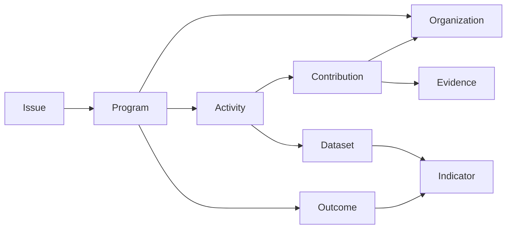

# 10 — Pentahelix Collaboration Layer

## 1. Prinsip

> Pusat kolaborasi adalah **shared context** (Issue, Program, Outcome), bukan sekadar shared login.

Lima sektor tidak dipisah menjadi lima sistem. Semua adalah `core_organizations` dengan kolom `sector` berbeda. Keanggotaan user eksternal lewat `organization_memberships` yang diverifikasi.

## 2. Entity (system entities, app `collaboration`)

Semua entity berikut adalah **system entity** bertipe `document`: skema dasar dikunci, tetapi Pemda boleh menambah _extension field_. Pilihan ini sengaja diambil supaya lapisan Pentahelix memakai metadata engine yang sama ("dogfooding"). Kalau engine cukup untuk Pentahelix, engine juga cukup untuk aplikasi lain.

| Entity         | Field inti                                                                                                                                          | Relasi                                                                 |
| -------------- | --------------------------------------------------------------------------------------------------------------------------------------------------- | ---------------------------------------------------------------------- |
| `issue`        | title, description, sdg_goals (multi_enum), priority, status                                                                                        | region (many_to_many), parent_issue                                    |
| `program`      | title, objective, period_start, period_end, budget_total (money)                                                                                    | issues (m2m), lead_org (m2o), participant_orgs (m2m)                   |
| `activity`     | title, schedule_start, schedule_end, location, status                                                                                               | program (m2o), executing_orgs (m2m), region                            |
| `contribution` | type (enum: regulation, research, funding, facility, expertise, campaign, volunteer, data), description, value_amount (money, opsional), value_unit | contributor_org (m2o), target (m2o → program/activity), evidence (m2m) |
| `partnership`  | title, agreement_type (mou, pks, lainnya), number, signed_on, valid_until, document (file)                                                          | parties (m2m org), programs (m2m)                                      |
| `evidence`     | title, type (document, photo, dataset, publication, link), file/url, captured_at                                                                    | –                                                                      |
| `outcome`      | title, description, baseline, achieved_on                                                                                                           | program (m2o), issues (m2m), indicators (m2m → indicators)             |

**Catatan MVP1 → MVP2:** `program` dan `activity` di MVP1 (Monitoring Program) **memakai entity ini sejak awal**. Program tidak dibuat ulang di aplikasi monev. Aplikasi monev hanya menambah entity `realization` (m2o → activity). Inilah uji arsitektur di doc 00 §23.

## 3. Traceability



Penelusuran "Issue X → … → Outcome" memakai _recursive CTE_ di atas `record_links` dengan batas kedalaman 6. Query ini diekspos sebagai:

```text
GET /apps/collaboration/issues/{id}/trace   → graph JSON (nodes, edges) + ringkasan per sektor
```

Tampilan grafnya **wajib punya alternatif tabel/daftar bertingkat** yang bisa dinavigasi keyboard (WCAG 1.1.1, 1.3.1). Visual graf adalah pelengkap.

## 4. Akses mitra eksternal

| Aspek        | Aturan                                                                                                       |
| ------------ | ------------------------------------------------------------------------------------------------------------ |
| Registrasi   | Self-register → pilih/ajukan organisasi → verifikasi oleh admin OPD pembina / `data_steward` (`verified_at`) |
| Scope        | User eksternal hanya bisa **menulis** contribution/evidence milik organisasinya sendiri                      |
| Baca         | Record berstatus `partner` atau `public`, plus program tempat organisasinya menjadi participant              |
| Data pribadi | Mitra tidak pernah mendapat clearance di atas `public` untuk data Pemda                                      |
| Keluar       | Membership dicabut → akses hilang; kontribusi historis tetap ada dengan atribusi                             |

## 5. Indikator kolaborasi (contoh reusable)

| Indikator                       | Formula                                                |
| ------------------------------- | ------------------------------------------------------ |
| Jumlah mitra aktif per sektor   | count distinct contributor_org per sector per tahun    |
| Rasio kontribusi non-pemerintah | contribution non-government / total contribution       |
| Nilai kontribusi non-APBD       | sum value_amount where contributor sector ≠ government |
| Program dengan ≥ 3 sektor       | count program where count distinct sector ≥ 3          |
| Cakupan evidence                | contribution dengan ≥ 1 evidence / total contribution  |

Semuanya didefinisikan sebagai process + indicator biasa. Tidak ada kode khusus Pentahelix.
